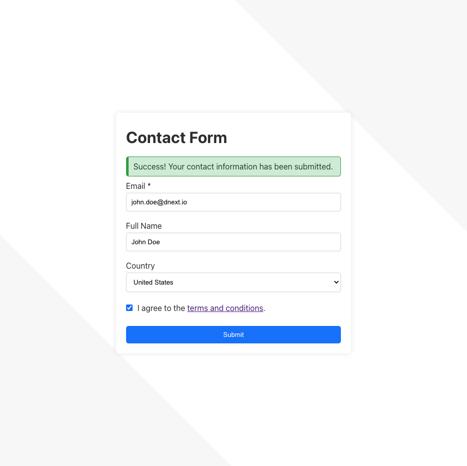

# Technical Interview

## Pre-requisite

You should have `node.js` installed in order to run the test, use the current long term support version. See https://nodejs.org/en/.

## The exercise

This exercise is the implementation of a simple contact interface.



This repository already contains a skeleton of an app, all you have to do is:

```sh
npm install
npm start
```

A dev server will be started on your machine at [`http://localhost:3000/`](http://localhost:3000/)

You will also need to start the mock server:

```sh
npm run mock
```

The mock server will be started on your machine at [`http://localhost:3001/`](http://localhost:3001/), and it will be used to simulate the backend API. The project is already configured to use this mock server as a proxy.

### Functional requirements:

- The email field is required.
- The login cannot be posted until all required fields are filled.
- Upon successful answer from the backend, the interface should display a success message.

### Browser Support

Your solution should support the latest Chrome, Firefox and Edge browsers.

### Backend API

The contact interface is provided with a mocked backend API, which comply with this OpenAPI specification:

```
openapi: 3.0.1
info:
  title: Contact Interface
  description: 'This is a sample contact interface server.'
  version: 1.0.0
paths:
  /api/contact:
    post:
      summary: Send a contact request
      requestBody:
        description: Contact request payload
        content:
          application/json:
            schema:
              $ref: '#/components/schemas/ContactRequest'
        required: true
      responses:
        400:
          description: Missing email
        200:
          description: Contact request succeedeed
components:
  schemas:
    ContactRequest:
      type: object
      properties:
        email:
          type: string
          description: 'Contact email'
        fullname:
          type: string
          description: 'Contact full name'
        country:
          type: string
          description: 'Contact country code'
      required:
        - 'email'

```

## Rules

* A pull request with your answer is expected on this repository at the due date, with an honest estimation of approximately how long it took you to complete the exercises. You should prepare this pull request the same way you would prepare a pull request for an existing open-source project.

* You cannot use any dependencies to solve the proposed problem, but you can still suggest what would have been useful to complete the problem in a more efficient way.
